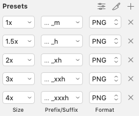

# 工作流程

每個案件都會有彈性，本次以一般案件流程來說明。

評估工時 > 提案 > 製作 > 交付檔案 

# 評估工時

* 由於iOS與Andorid系統（原生）介面上、操作方式等細節不同，開發上會個別做出兩個系統的畫面，以方便工程師製作；所以在評估工時時，必須**連同兩個系統的時間都評估進來**。

* App製作有一個比較特別的地方，就是**guideline的撰寫**：這是當設計完成畫面與元件交付程式時，一定要在畫面上描述詳細，特別是外部程式！程式不會讀心，寫得仔細對雙方都好～！

## 報價粗估

[範例文件](https://docs.google.com/spreadsheets/d/11ycQG_NtNeFtlTk8SYs72BuXE1BZ6bXXk2RA2z5x-L8/edit#gid=20463260)**（這份文件遺漏評估「App上架相關」的工時）**

## 確定進案 詳細甘特圖

[範例文件](https://google.gantter.com/gantterforgoogleapps/index.html?fileID=1NgBP57tq9fUbqaOGinUYgB7UW1jw00AB#amode=marketplace&fileID=1NgBP57tq9fUbqaOGinUYgB7UW1jw00AB)（設計的部分不知為何不見了QQ，先用程式的當作範例）

# 提案

畫面製作建議使用sktech，方便製作多個畫面及切元件。提案時，依照案件有時會提供prototype給客戶體驗。（注意：若提案時會有prototype，別忘了也要**估進工時裡**唷！）

使用工具：sketch、inVision

* ### inVision的概略介紹
    (1) [inVision](https://www.invisionapp.com/)的免費帳號只能擁有一個prototype專案。

    (2) 上傳方式有兩種：一是直接在網站上傳圖片，二或安裝[Craft](https://www.invisionapp.com/craft)套件到sketch中。

     

    Craft簡易教學可參考[這裡](https://tpu.thinkpower.com.tw/tpu/articleDetails/1207)。

    在sketch使用Craft做prototype，與直接在inVision製作的效果有差，要在哪裡製作可以自己斟酌；我的做法是利用Craft將畫面直接上傳到inVision，再到inVision做prototype，因為固定上下的功能目前只能在inVision做到。

    

# 製作

整體案件繁複的話，在製作畫面前，通常會建議做wireframe和客戶確認flow。wireframe的工具很多，但我多半還是直接使用sketch，
當然就是**幾個簡單的色塊**，不會有太多細膩的著墨。至於flow的展示就是交給PM了，所以wirefrmae交付不會有動態，是一張張的畫面。

###  wireframe

### mockup

wireframe與flow在與客戶溝通的時間，可以稍微進行製作mockup。

# 交付檔案

畫面底定之後，可以來切元件和寫guideline囉！

* ### 元件：iOS與Andorid所需要的元件規格不同，請依下列圖示命名方式命名。

  ## iOS
  

  iOS的元件沒有指定資料夾，可以直接擺放（請見下圖）:

  

  ## Andorid
  

  但Andorid必須放入指定的資料夾（請見下圖）：

  

  (1) Andorid一個元件輸出5個檔案，程式有供一個「[rename.command](rename.command)」執行檔，請將執行檔和元件放在同一層，點選之後便能快速將元件分類資料夾！

  (2) Andorid元件命名若是要使用符號，建議使用「底線 _ 」，不要使用「橫線 - 」(Android系統會有問題的樣子)；因為會同時製作兩個系統，建議乾脆就都用底線，兩邊製作起來也方便～。

* ### guideline
    guideline是要讓程式在製作App時，有指示的畫面來比照排版與動態；我們使用Zeplin這個軟體，以下是概略解說：

    (1) [plugin Zeplin](https://support.zeplin.io/en/articles/244927-installing-sketch-plugin) 到 sketch 中

    (2) 由於guideline需求量大，所以使用公司付費帳號。

    (3) zeplin上會自動顯示的寬高、色碼等基本資訊；

       

    其中重要的就是另外寫上備註解說，

    

    如果有線上動態給程式觀看參考是最理想，沒有的話就是盡可能說明；所以備註說明大概會是說明動態效果的顯示方式，或者更新什麼地方讓程式知道。
  
## App上架相關檔案
* ### App icon

  iOS與Android所需要的App icon檔案不同，也會因為各家系統改版的關係，上架時需要的檔案也會有所變動。

  ### iOS

     

    (1) 已經有模板，請使用[模版](App_Icon_ios.sketch)輸出。
  
    (2) 不需要切圓角。

    ### Andorid

        

     (1) Anroid 8.0之後，App icon 的做法變成前後景，有模板，請使用[模版](ic_launcher.sketch)輸出。

     (2) google play則是需要一張 512x512 的大圖。

     (3) status bar 中的icon有四種size，也請一併給程式。(第二點和第三點也有模板，請使用[模版](status_bar_android.sketch)輸出)

* ### 螢幕擷取畫面：iOS與Android需要的尺寸不同

  ### iOS
  
  iOS需要5.5吋、5.8吋、6.5吋、12.9吋四種size；有模板，請使用[模版](ios_螢幕擷取畫面.ai)輸出。

   

  ### Andorid

  Andorid需要的圖片相對單純很多，需要5吋與 google play 主題圖片；有模板，請使用[模版](andriod_螢幕擷取畫面.ai)輸出。

   

以上說明～希望大家專案進行順利！

 
